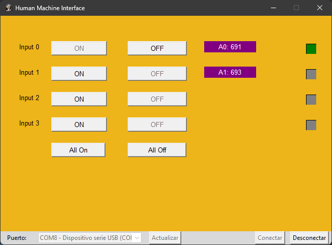

# ITESCA_HMI
Proyecto de residencias profesionales  
Sistema de Interfaz Humano Maquina usando python Tkinter  

Probado en micropython con:  
- Raspberry pi pico (RP2040)
- Esp-WROOM-32 
- Esp32s2 

Implementando :
- 4 Entradas Digitales
- 2 Enradas Analogas
- 4 Salidas Digitales 

> [!NOTE]
> Este proyecto ha sido planteado desde le principio como un prototipo

Programador: Diego Ramos A.

Ingeniero Electrónico especializado en Mecatrónica  
Matricula: 20130235  
Correo de contacto: diegogaelramosacosta@gmail.com  

Asesor externo de residencias: Mtro. Iván Oswaldo Luna Rodríguez  
Asesor interno de recidencias: Mtra. Ana Mayra Luna Rodríguez
